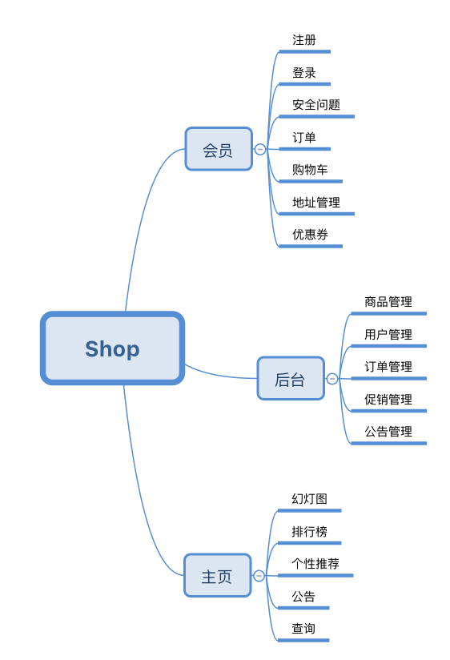

购物系统
=====================
   

在线商城项目，持续完善中...

## 启动服务

    com.vito16.shop.Application.main()
    
主页：[http://localhost:8081/](localhost:8081/)  
后台：[http://localhost:8081/admin/login](localhost:8081/admin/login)  

## 配置修改
可以在application.properties中修改相关配置（http服务端口、数据库配置...）

- 访问端口：server.port
- 数据库相关配置：jdbc.***

